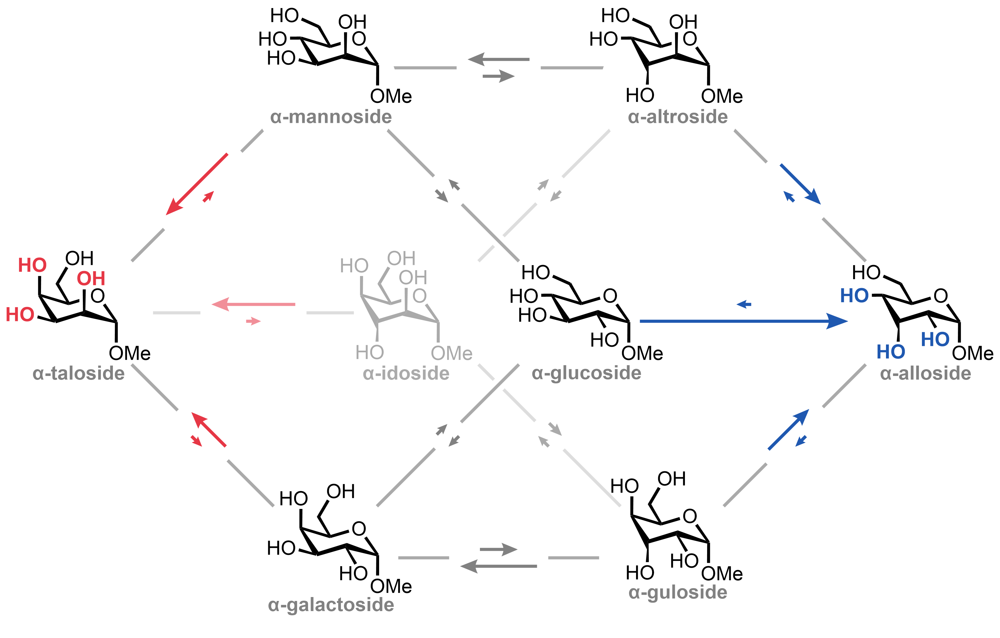
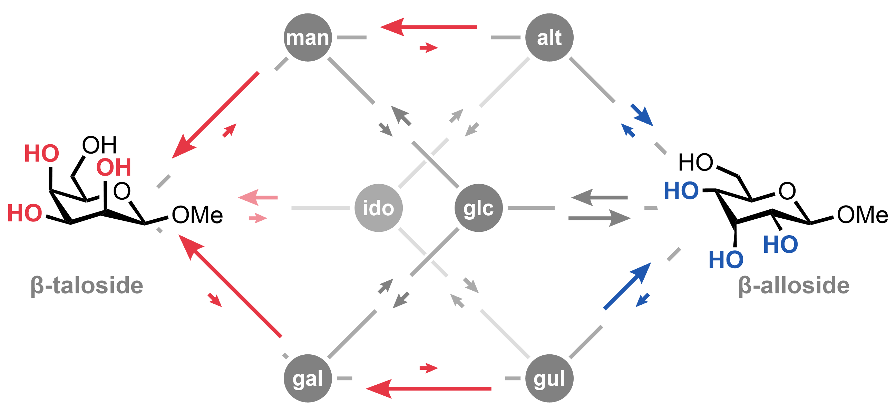

# Networks

`network_cdxml.ipynb` leverages ElementTree package in python to generate a ChemDraw XML file with a cubic network with arrows scaled to rate constant magnitude. These are used to generate the networks that appear in Figure 3C and 3E. This directory contains the csv parameter files used for both the alpha and beta networks as well as the drawing parameters used for each (in the notebook).

This script can be used to generate figures such as the following:

