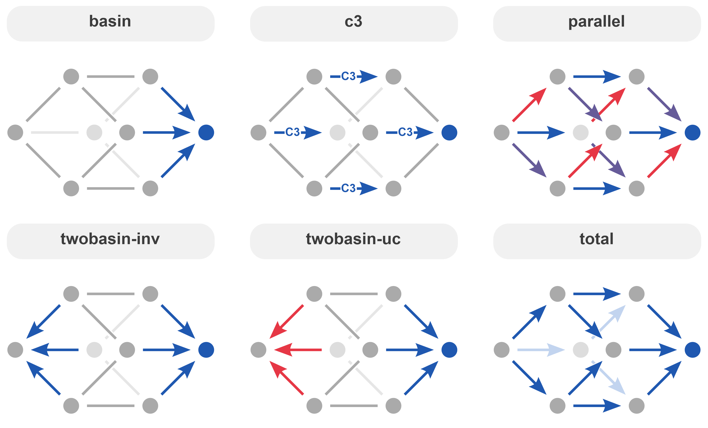

# Simulation data and analysis scripts

### Introduction

This directory contains julia code for generating random rate constants and simulating their behavior in both short term (transient) and steady state (asymptote) regimes. Code for running and analyzing the results of these simulations is provided, along with the data generated by the simulations performed in the study. This is used for Figure 5 in the manuscript and SI section 6.

Random rate constants and selectivities are generated using a lognormal distribution from an array of mean values and a covariance matrix with the Distributions.jl package. The covariance matrix is generated from a correlation matrix which is related by the product of the variance. A 24x24 matrix of rate constants and selectivities are generated (the first 12 are rate constants, the second 12 are selectivities). This approach allows for correlation between rate constants, selectivities, or both. For the present study, we chose to focus on the correlation between selectivities.

Rates and selectivities are generated as follows and then used to simulate the system:
```julia
d = MvLogNormal(local_means, cov_matrix)
x = rand(d)
rates = x[1:length(connections)]
sels = x[length(connections)+1:end]
```

### Asymptote Simulations

Asymptote data (end steady state) for the stochastic simulations. The steady state was determined by simulating the final concentration after an arbitrary 50,000 seconds from opposite notes (in this case "glucose" and "idose"). If the resulting concentrations matched, the asymptote (which is start position independent) was likely established. Otherwise the simulation was run with increasing length until agreement was established.

Simulate asymptote given a network:
```julia
tspan = (0.0, 50_000.0)
init_conc1 = Dict(Species(id="Glc") => 0.2, Species(id="Catalyst") => 0.004)
init_conc2 = Dict(Species(id="Ido") => 0.2, Species(id="Catalyst") => 0.004)
run1 = simulate_timecourse(network, init_conc1, tspan, tspan).u[end]
run2 = simulate_timecourse(network, init_conc2, tspan, tspan).u[end]
if isapprox(run1, run2, atol=0.01)
    return run1
else
    # until they are approximately the same, double the timespan
    while !isapprox(run1, run2, atol=0.01)
        tspan = (0.0, tspan[2] * 2)
        run1 = simulate_timecourse(network, init_conc1, tspan, tspan).u[end]
        run2 = simulate_timecourse(network, init_conc2, tspan, tspan).u[end]
    end
    return run1
end
```

The simulation results are given in the asymptote-data folder. Each file contains data from 10_000 simulations, each row representing one simulation. Columns are steady state concentrations (M) for each species. Files are named according to the parameters used: (correlation type)_(bias)_(edge correlation).csv.

The following correlation types were simulated: `basin`, `c3`,`parallel`, `twobasin-inv`, `twobasin-uc`, and `total`. Graphically these correlations are represented by the following networks in which color is used to indicate edges with selectivities that are correlated together. Although arrow direction is indicated, the correlations themselves have no directionality associated, instead that selectivities between these connections are similar. Each simulation was run with either no bias or a selectivity bias equivalent to 0.5 kcal/mol in the direction of the arrows. Each simulation was run with edge correlations of 0, 0.2, 0.4, 0.6, 0.8. A correlation of 0.8 was used for the data presented in Figure 5 of the manuscript.



For processing, file names are parsed to extract the correlation type, bias, and edge correlation. The data is then processed to determine how many of the 10,000 simulations had a selectivity greater than 0.5 for the desired product ("allose"). The results are printed to the console.

### Transient Simulations

Transient data for the stochastic simulations. Random rate constants and selectivities were generated as above (although the code allows for introduction of correlation, our study in the transient regime elected to focus on uncorrelated networks). For each simulation setup, 8 timecourses were simulated, starting with each isomer and tracking the maximum concentration of every species over time (up to 50,000 seconds, saving 1,000 logarthmically spaced time points).

Simulate transient maxima given a network:
```julia
tspan = (0.0, 50_000.0)
teval = (10 .^ (range(2, stop=log10(tspan[2]), length=1_000))...,)
species_ids = sort(collect([x.id for x in network.species]))

results = []
# for each start isomer (excluding catalyst species) run a simulation
for s in species_ids
    if (s == "Catalyst") || (s == "Catalyst_Dead")
        continue
    end

    init_conc = Dict(Species(id=s) => 0.2, Species(id="Catalyst") => 0.004)
    run = simulate_timecourse(network, init_conc, tspan, teval).u
    max_cons = maximum(hcat(run...), dims=2)
    push!(results, max_cons)
end

return vcat(results...)
```

The simulation results are given in the transient-data folder. This file contains one csv file with 10_000 rows, each row representing one set of rate constants. Columns are titled ("start"_"tracked") according to the "start" species and "tracked" species, where the data point is the maximum for the "tracked" species over the course of a simulation that starts with the 'start' species.

The simulation results are processed to determine the number of distinct products with a maximum selectivity greater than 50% (ignoring trivial cases such as the initial isomer). Additionally, results are processed using the edit distance between the start and tracked species (determined by the shortest path between the isomers).

### Running simulations

Simulation scripts are designed to be run with multiple threads. The number of threads can be specified by adding `--threads n` to the julia command. The simulations can be run with the following commands (in this case using 128 threads):

```bash
julia --threads 128 run_asymptote.jl
julia --threads 128 run_transient.jl
```

### Running processing scripts

These scripts print the simulation results to the console. The transient processing script also generates a histogram of the transient probabilities sorted by edit distance. These scripts can be run with the following commands:

```bash
julia asymptote-process.jl
julia transient-process.jl
```
